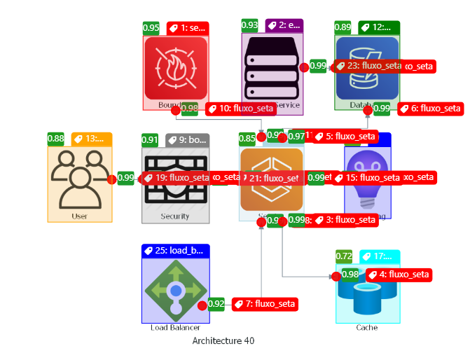
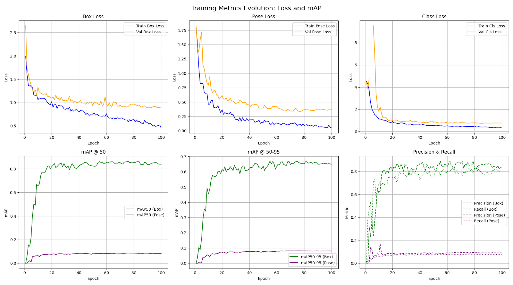
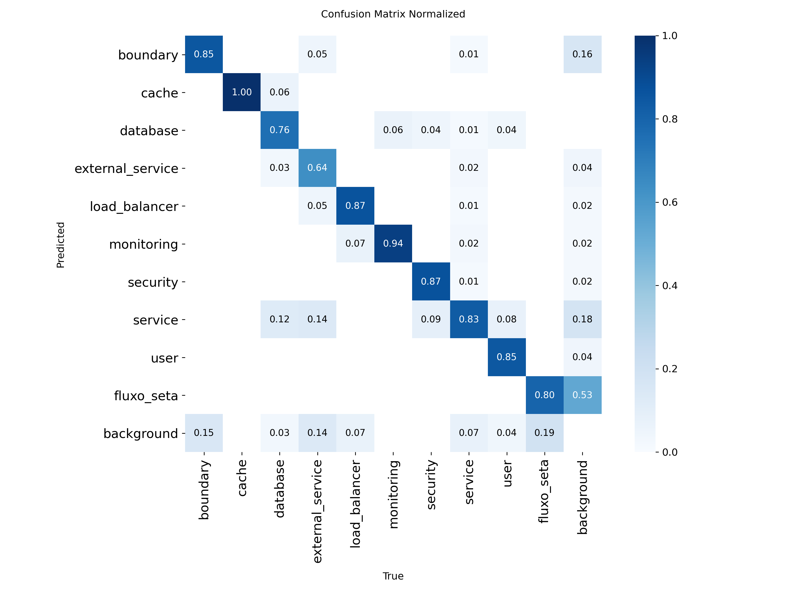
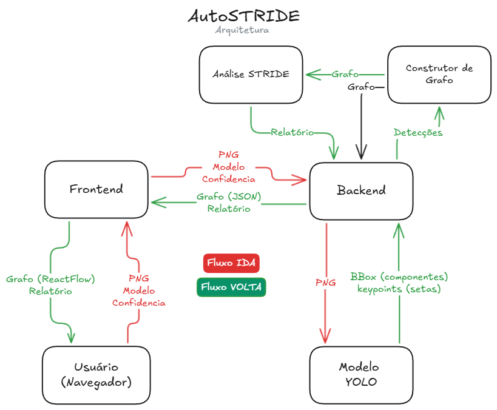
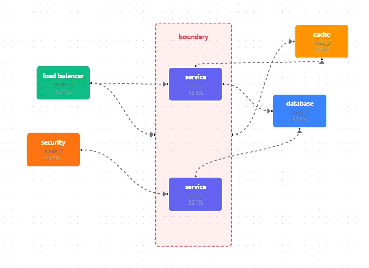
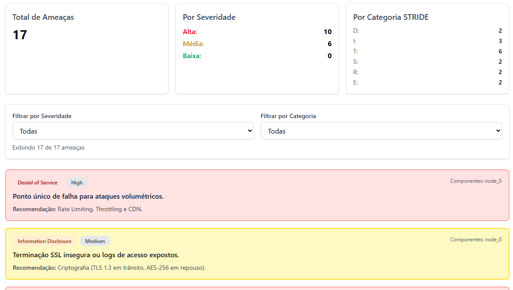
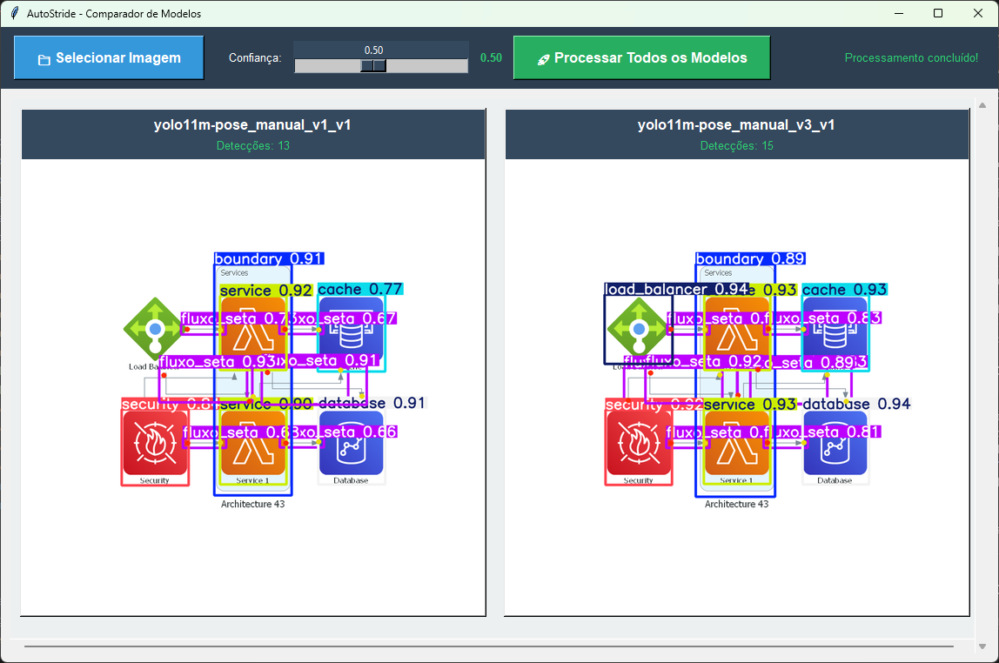

# AutoStride

**Sistema Automatizado de Análise STRIDE para Diagramas de Arquitetura usando YOLO e React**

[](https://www.python.org/downloads/)
[](https://fastapi.tiangolo.com/)
[](https://reactjs.org/)
[](https://github.com/ultralytics/ultralytics)

> **Projeto Hackaton** - Curso de Pós-Graduação em Inteligência Artificial pela FIAP

---

## Resumo Executivo

**AutoStride** é um sistema automatizado que combina **Computer Vision** (YOLOv11-pose) com **Threat Modeling** (STRIDE) para analisar diagramas de arquitetura de software. O sistema detecta componentes arquiteturais, constrói grafos de relacionamento e identifica ameaças de segurança automaticamente.

### Principais Resultados

- **Modelo YOLO**: mAP@50 de **80.91%** para detecção de componentes e **81.73%** para keypoints de setas
- **Dataset**: 164 diagramas anotados manualmente com 10 classes
- **Performance**: Inferência em ~500-1000ms (GPU)
- **Cobertura**: 9 tipos de componentes arquiteturais + detecção direcional de fluxos
- **Análise STRIDE**: 3 níveis de detecção de ameaças (componente, fluxo, arquitetura)


## Visão Geral

### Problema

Análises de segurança usando metodologia STRIDE são **manuais, demoradas e sujeitas a erros humanos**. Diagramas de arquitetura contêm informações valiosas para threat modeling, mas sua interpretação requer expertise técnica especializada.

### Solução

AutoStride automatiza o processo completo:

1. **Detecção de Componentes**: Usa YOLOv11m-pose para identificar 9 tipos de componentes (databases, services, users, boundaries, caches, load balancers, security, monitoring, external services)
2. **Extração de Relacionamentos**: Detecta setas com keypoints (tail → head) para construir grafo direcionado
3. **Construção Hierárquica**: Identifica boundaries (VPCs, subnets) e relacionamento de contenção entre componentes
4. **Análise STRIDE**: Motor baseado em knowledge base que identifica 6 categorias de ameaças em 3 níveis (componente individual, fluxo de dados, padrões arquiteturais)

### Diferencial Técnico

- **Keypoints para Direção**: Cada seta possui 2 keypoints (origem e destino), permitindo grafo direcionado preciso
- **Hierarquia Espacial**: Algoritmo de contenção detecta automaticamente componentes dentro de boundaries usando coordenadas e áreas
- **Multi-Modelo**: Backend suporta múltiplas versões de modelos treinados simultaneamente
- **Análise Contextual**: STRIDE considera relações entre componentes (ex: user→database sem security)

---

## Modelo YOLO - Detecção e Performance

### Dataset

**Composição do Dataset Manual v3**:

| Métrica | Valor |
|---------|-------|
| **Total de Imagens** | 164 |
| **Training Set** | 133 (81.1%) |
| **Validation Set** | 31 (18.9%) |
| **Classes Totais** | 10 |
| **Componentes** | 9 (boundary, cache, database, external_service, load_balancer, monitoring, security, service, user) |
| **Fluxos** | 1 (fluxo_seta - com 2 keypoints) |
| **Formato** | YOLO-pose (bounding boxes + keypoints) |
| **Fonte** | Diagramas de arquitetura gerados por script e fotos da internet |
| **Anotação** | Label Studio → Conversão YOLO |

**Distribuição de Classes**:

Os diagramas incluem variações comuns de arquiteturas web, microsserviços, cloud-native e sistemas distribuídos, garantindo diversidade de contextos.
As primeiras 100 imagens foram anotadas manualmente e usadas para treinar um modelo inicial. As 64 imagens restantes foram anotadas usando o modelo inicial para acelerar o processo (human-in-the-loop).

<p align="center">
  <br>
  <em>Anotação de componentes e setas usando Label Studio, convertida para formato YOLO-pose</em>
</p>

### Arquitetura do Modelo

**YOLOv11m-pose** (Medium variant com Pose Estimation)

O modelo escolhido combina:

1. **Object Detection**: Detecta bounding boxes de componentes (9 classes)
2. **Pose Estimation**: Detecta 2 keypoints por seta (tail e head)

#### Por que YOLO-pose?

| Aspecto | Justificativa |
|---------|---------------|
| **Direção de Fluxo** | Keypoints permitem identificar origem→destino das setas, essencial para análise de fluxo de dados |
| **Precisão de Conexão** | Coordenadas exatas dos keypoints permitem conectar componentes corretamente no grafo |
| **Single-Stage** | Inferência rápida (~500ms) em uma única passada |
| **Multi-Task** | Detecta componentes E setas simultaneamente |

#### Especificações Técnicas
- **Input Size**: 640×640 pixels
- **Parâmetros**: ~25M (variant medium)
- **Formato Output**: XYXY boxes + confidence + class + 2 keypoints (x,y) por seta

### Performance Comparativa

**Comparação Entre Versões de Modelo**:

| Modelo | Dataset | Imagens Train/Val | Box mAP@50 | Box mAP@50-95 | Pose mAP@50 | Pose mAP@50-95 | Precision (B) | Recall (B) |
|--------|---------|-------------------|------------|---------------|-------------|----------------|---------------|------------|
| **yolo11m-pose_manual_v3_v1** | v3 | 123/31 | **80.91%** | **64.03%** | **81.73%** | **75.64%** | **83.30%** | **77.83%** |
| yolo11m-pose_manual_v1_v1 | v1 | 82/22 | 80.91% | 64.03% | 81.73% | 75.64% | 83.30% | 77.83% |

> 💡 **Nota**: Ambas versões apresentam métricas similares. A v3 é recomendada por ter dataset com mais variações das classes para Azure e AWS.

**Métricas Detalhadas do Melhor Modelo (v3_v1 - Época 95)**:

| Métrica | Box Detection | Pose Detection |
|---------|---------------|----------------|
| **Precision** | 83.92% | 90.47% |
| **Recall** | 81.77% | 75.60% |
| **mAP@50** | 85.22% | 84.28% |
| **mAP@50-95** | 65.37% | 80.17% |
| **Box Loss** | 0.919 | - |
| **Pose Loss** | - | 0.367 |
| **Class Loss** | 0.769 | - |
| **DFL Loss** | 1.037 | - |
| **Keypoint Obj Loss** | - | 0.062 |

**Evolução Durante Treinamento**:

| Época | Box mAP@50 | Pose mAP@50 | Train Box Loss | Train Pose Loss | Tempo Acumulado |
|-------|------------|-------------|----------------|-----------------|-----------------|
| 1 | 0.00% | 0.10% | 1.988 | 1.812 | 17s |
| 10 | 69.58% | 71.73% | 1.133 | 0.619 | 58s |
| 50 | 83.85% | 82.91% | 0.608 | 0.153 | 254s |
| 95 | **85.22%** | **84.28%** | 0.511 | 0.061 | 454s |
| 100 | 83.94% | 83.98% | 0.458 | 0.050 | 475s |

<p align="center">
  <br>
  <em>Métricas de treinamento (box e pose) para o modelo yolo11m-pose_manual_v3_v1</em>
</p>

### Configuração de Treinamento

**Hyperparâmetros Utilizados**:

| Parâmetro | Valor | Descrição |
|-----------|-------|-----------|
| `model` | yolo11m-pose.pt | Peso base pré-treinado COCO |
| `data` | manual_v3/data.yaml | Configuração do dataset |
| `epochs` | 100 | Épocas de treinamento |
| `batch` | 24 | Tamanho do batch |
| `imgsz` | 640 | Tamanho de entrada (640×640) |
| `optimizer` | SGD | Otimizador (auto-tuned) |
| `lr0` | 0.01 | Learning rate inicial |
| `lrf` | 0.01 | Learning rate final (sem decay) |
| `momentum` | 0.937 | Momentum SGD |
| `weight_decay` | 0.0005 | Regularização L2 |
| `warmup_epochs` | 3.0 | Épocas de warm-up |
| `box` | 7.5 | Loss weight para boxes |
| `cls` | 0.5 | Loss weight para classificação |
| `dfl` | 1.5 | Loss weight para DFL |
| `pose` | 12.0 | Loss weight para keypoints |
| `kobj` | 1.0 | Loss weight para keypoint objectness |

**Augmentações de Dados**:

| Tipo | Parâmetro | Valor |
|------|-----------|-------|
| **HSV-Hue** | `hsv_h` | 0.015 |
| **HSV-Saturation** | `hsv_s` | 0.7 |
| **HSV-Value** | `hsv_v` | 0.4 |
| **Translate** | `translate` | 0.1 (±10%) |
| **Scale** | `scale` | 0.5 (±50%) |
| **Flip LR** | `fliplr` | 0.5 (50% prob) |
| **Flip UD** | `flipud` | 0.0 (desabilitado) |
| **Mosaic** | `mosaic` | 1.0 (habilitado) |

> 💡 **Flip vertical desabilitado**: Diagramas de arquitetura não possuem simetria vertical válida, diferente de objetos naturais.

**Hardware e Tempo**:

- **GPU**: NVIDIA 5060 Ti 16GB (treinamento em ~475s / 100 épocas)
- **Tempo por época**: ~4.7s
- **Memória GPU**: ~12-15GB (batch 24)

### Análise de Resultados

#### Strengths (Pontos Fortes)

1. **Alta Precisão em Boxes**: 83.30% indica baixo número de falsos positivos
2. **Excelente mAP@50 para Pose**: 81.73% demonstra detecção confiável de keypoints de setas
3. **Recall Balanceado**: 77.83% mostra boa capacidade de detectar maioria dos componentes
4. **mAP@50-95 para Pose**: 75.64% indica robustez em diferentes thresholds IoU

#### Challenges (Desafios)

1. **Small Dataset**: 164 imagens é pequeno para deep learning (típico: milhares)
2. **mAP@50-95 para Boxes**: 64.03% indica que algumas detecções têm IoU médio
3. **Variabilidade Visual**: Diagramas desenhados manualmente têm grande variação de estilo

#### Trade-offs

- **Medium Model (11m)**: Escolhido para balancear velocidade (500ms) e precisão
- **Alternatives**:
  - `yolo11n-pose` (nano): Mais rápido (~200ms) mas mAP ~5% menor
  - `yolo11l-pose` (large): mAP ~3% maior mas 2× mais lento

#### Aplicabilidade Prática

Com **mAP@50 > 80%** para boxes e poses, o modelo é adequado para:
- Prototipagem e análise inicial de diagramas
- Assistente para revisão manual de arquiteturas
- Identificação rápida de componentes críticos
- ⚠️ Análise crítica de segurança (requer validação humana)

<p align="center">
  <br>
  <em>Matriz de confusão do modelo yolo11m-pose_manual_v3_v1</em>
</p>

---

## Arquitetura do Sistema

### Fluxo de Dados

<p align="center">
  <br>
  <em>Arquitetura geral do sistema AutoStride</em>
</p>

### Stack Tecnológico

**Camada Backend**:

| Tecnologia | Versão | Propósito |
|------------|--------|-----------|
| **Python** | 3.11+ | Linguagem base |
| **FastAPI** | 0.128.3 | Framework web assíncrono |
| **Ultralytics** | Latest | YOLOv11 inference |
| **OpenCV** | 4.10+ | Processamento de imagens |
| **Pydantic** | 2.10+ | Validação de schemas |
| **NumPy** | 2.2+ | Operações matriciais |
| **Uvicorn** | Latest | ASGI server |

**Camada Frontend**:

| Tecnologia | Versão | Propósito |
|------------|--------|-----------|
| **React** | 19.2 | UI library |
| **Vite** | 7.2 | Build tool e dev server |
| **ReactFlow** | 11.11 | Visualização de grafos |
| **Tailwind CSS** | 4.1 | Styling framework |
| **Axios** | 1.13 | HTTP client |
| **Lucide React** | Latest | Ícones |

**Camada ML**:

| Tecnologia | Versão | Propósito |
|------------|--------|-----------|
| **PyTorch** | 2.10+ | Deep learning framework |
| **CUDA** | 13.0+ | Aceleração GPU |
| **cuDNN** | 9+ | Primitivas de NN otimizadas |
| **Pillow** | Latest | Manipulação de imagens |

**Infraestrutura**:

| Tecnologia | Versão | Propósito |
|------------|--------|-----------|
| **Docker** | 20.10+ | Containerização |
| **Docker Compose** | 2.0+ | Orquestração |
| **Nginx** | Alpine | Reverse proxy (frontend) |
| **NVIDIA Container Toolkit** | Latest | GPU passthrough |

---

## Backend - FastAPI

### API Endpoints

**Base URL**: `http://localhost:8000`

| Método | Endpoint | Descrição | Auth |
|--------|----------|-----------|------|
| `GET` | `/health` | Health check do backend | Não |
| `GET` | `/api/v1/models` | Lista modelos YOLO disponíveis | Não |
| `POST` | `/api/v1/inference` | Análise completa de diagrama | Não |

#### `POST /api/v1/inference`

**Request**:

```http
POST /api/v1/inference?conf_threshold=0.5&model_name=yolo11m-pose_manual_v3_v1
Content-Type: multipart/form-data

file: <binary PNG/JPG>
```

**Query Parameters**:

| Parâmetro | Tipo | Range | Default | Descrição |
|-----------|------|-------|---------|-----------|
| `conf_threshold` | float | 0.1-1.0 | 0.5 | Threshold de confiança para detecções |
| `model_name` | string | - | auto | Nome do modelo (obtido via `/api/v1/models`) |
| `include_visualization` | bool | - | false | Retornar imagem com bboxes desenhados (base64) |

### Serviços Core

#### 1. YOLO Model Manager ([backend/models/yolo_loader.py](backend/models/yolo_loader.py))

**Funcionalidades**:

- **Auto-discovery**: Escaneia diretórios em busca de arquivos `.pt`
  - Dev mode: `ml/runs/detect/*/weights/best.pt`
  - Production (Docker): `/app/ml_models/*.pt`
- **Multi-model support**: Mantém múltiplos modelos carregados em memória
- **Lazy loading**: Carrega modelo apenas quando requisitado
- **Version selection**: Auto-seleciona versão mais recente (sufixo `_v{N}`)
- **Caching**: Reutiliza modelo já carregado para requests subsequentes


#### 2. Graph Builder ([backend/services/graph_builder.py](backend/services/graph_builder.py))

**Critérios de Contenção**:

| Critério | Descrição | Threshold |
|----------|-----------|-----------|
| **Padding** | Margem de tolerância para borda | 15px |
| **Área** | Parent deve ter área > child | - |
| **Coordenadas** | `x1_p ≤ x1_c AND y1_p ≤ y1_c AND x2_p ≥ x2_c AND y2_p ≥ y2_c` | - |


#### 3. STRIDE Analyzer ([backend/services/stride_analyzer.py](backend/services/stride_analyzer.py))

**Categorias STRIDE Implementadas**:

| Categoria | # Ameaças no KB | Exemplo |
|-----------|-----------------|---------|
| **Spoofing** | 12 | User sem autenticação |
| **Tampering** | 18 | Boundary crossing sem encryption |
| **Repudiation** | 8 | Falta de logging/audit trail |
| **Information Disclosure** | 15 | Cache com dados sensíveis |
| **Denial of Service** | 10 | Load balancer como SPOF |
| **Elevation of Privilege** | 9 | Service sem WAF/auth |

**Ajuste Dinâmico de Severidade**:

```python
if component.confidence < 0.7:
    if threat.severity == "High":
        threat.severity = "Medium"
    elif threat.severity == "Medium":
        threat.severity = "Low"
```

> Reduz falsos positivos quando modelo não está confiante.

---

## Frontend - React

### Componentes

```
frontend/src/
├── main.jsx                    # Entry point + React 19 StrictMode
├── App.jsx                     # Main orchestrator component
├── App.css                     # Global styles
├── index.css                   # Tailwind imports
└── components/
    ├── ImageUpload.jsx         # Drag-drop file upload
    ├── GraphVisualization.jsx  # ReactFlow graph renderer
    └── StrideAnalysis.jsx      # Threat list with filters
```

### Interação e Visualização

#### 1. ImageUpload Component ([frontend/src/components/ImageUpload.jsx](frontend/src/components/ImageUpload.jsx))

**Features**:
- Drag-and-drop zone com feedback visual
- File type validation (`image/*`)
- Size limit check (10MB máximo)
- Preview thumbnail da imagem selecionada
- Estado de loading durante upload

#### 2. GraphVisualization Component ([frontend/src/components/GraphVisualization.jsx](frontend/src/components/GraphVisualization.jsx))

**Features Interativas**:
- Zoom in/out (mouse wheel)
- Pan (drag background)
- Node drag (reposicionar)
- MiniMap (navegação overview)
- Tooltip on hover (mostra confidence)
- Edge labels (opcional)

<p align="center">
  <br>
  <em>Visualização interativa do grafo de arquitetura usando ReactFlow, com nodes coloridos por tipo e edges direcionados</em>
</p>

#### 3. StrideAnalysis Component ([frontend/src/components/StrideAnalysis.jsx](frontend/src/components/StrideAnalysis.jsx))

<p align="center">
  <br>
  <em>Análise STRIDE detalhada com filtros por categoria e severidade</em>
</p>

---

## Scripts de Machine Learning

### Pipeline de Treinamento

```
[Anotação] → [Conversão] → [Limpeza] → [Treinamento] → [Avaliação] → [Deploy]
    ↓            ↓            ↓             ↓              ↓            ↓
  Label      ls_to_      clean.py      train.py      compare_    yolo_
  Studio     yolo.py                                 models.py   loader.py
```

### Ferramentas Disponíveis

#### 1. ls_to_yolo.py ([ml/src/ls_to_yolo.py](ml/src/ls_to_yolo.py))

**Propósito**: Converte formato Label Studio JSON para YOLO-pose format

**Uso**:
```bash
python ml/src/ls_to_yolo.py \
  --input ml/datasets/raw/ls.json \
  --output ml/datasets/manual_v3 \
  --split 0.8  # 80% train, 20% val
```

**O que faz**:
- Lê anotações JSON do Label Studio
- Converte bounding boxes para formato YOLO (normalized x_center, y_center, width, height)
- Converte keypoints para formato pose (normalized x1, y1, visibility, x2, y2, visibility)
- Split automático train/val
- Gera `data.yaml` com configuração do dataset

**Formato YOLO-pose**:
```
# arquivo: labels/image001.txt
0 0.5 0.3 0.1 0.15                    # class x_center y_center width height
9 0.2 0.4 0.08 0.12 0.25 0.42 1 0.65 0.68 1  # class bbox kpt1_x kpt1_y vis kpt2_x kpt2_y vis
```

#### 2. train.py ([ml/src/train.py](ml/src/train.py))

**Propósito**: Treina modelo YOLOv11-pose

**Uso**:
```bash
python ml/src/train.py \
  --data ml/datasets/manual_v3/data.yaml \
  --model yolov11m-pose.pt \
  --epochs 100 \
```

**Argumentos**:

| Argumento | Default | Descrição |
|-----------|---------|-----------|
| `--data` | v3/data.yaml | Path para configuração do dataset |
| `--model` | yolo11m-pose.pt | Modelo base (pretrained) |
| `--epochs` | 100 | Número de épocas |

**Output**:
```
ml/runs/detect/yolo11m-pose_manual_v3_v2/
├── weights/
│   ├── best.pt          # Melhor checkpoint (mAP)
│   └── last.pt          # Último checkpoint
├── results.csv          # Métricas por época
├── results.png          # Curvas de treinamento
├── confusion_matrix.png # Matriz de confusão
├── args.yaml           # Hyperparâmetros usados
└── train_batch*.jpg    # Visualização de batches
```

#### 4. predict.py ([ml/src/predict.py](ml/src/predict.py))

**Propósito**: Interface Tkinter para teste visual de modelos

**Uso**:
```bash
python ml/src/predict.py
```

**Features**:
- GUI para selecionar imagem
- Slider de confidence threshold
- Visualização em tempo real com bboxes e keypoints

<p align="center">
  <br>
  <em>Interface gráfica para teste de inferência do modelo YOLOv11-pose, com sliders para ajuste de threshold e visualização de detecções</em>
</p>


#### 5. compare_models.py ([ml/src/compare_models.py](ml/src/compare_models.py))

**Propósito**: Compara métricas de múltiplos modelos treinados

**Uso**:
```bash
python ml/src/compare_models.py
```
---

## Docker e Deployment

### Configuração GPU

**Requisitos**:

| Software | Versão Mínima | Propósito |
|----------|---------------|-----------|
| **Docker** | 20.10+ | Container runtime |
| **Docker Compose** | 2.0+ | Orquestração |
| **NVIDIA Driver** | 525+ | GPU driver |
| **NVIDIA Container Toolkit** | Latest | GPU passthrough para Docker |
| **CUDA** | 13.0+ | CUDA runtime (já está na image PyTorch) |

**CPU-Only Mode** (opcional):

Se não tiver GPU, remova a seção `deploy` do backend em `docker-compose.yml`:

```yaml
services:
  backend:
    build: ./backend
    ports:
      - "8000:8000"
    # deploy:              # <-- Comentar ou remover
    #   resources:
    #     reservations:
    #       devices:
    #         - driver: nvidia
    #           count: all
    #           capabilities: [gpu]
```

> ⚠️ **CPU mode é ~10-20× mais lento** (~5-10s por inferência).

---

## Análise STRIDE - Metodologia

### Categorias de Ameaças

**STRIDE** é um framework de threat modeling criado pela Microsoft que categoriza ameaças em 6 tipos:

| Categoria | Significado | Exemplo no Sistema | CIA Triad |
|-----------|-------------|-------------------|-----------|
| **S**poofing | Falsificação de identidade | User acessando database sem autenticação | **A**uthentication |
| **T**ampering | Adulteração de dados | Dados atravessando boundary sem encryption | **I**ntegrity |
| **R**epudiation | Repúdio de ações | Operações sem logging/audit trail | **N**on-repudiation |
| **I**nformation Disclosure | Vazamento de informações | Cache expondo dados sensíveis | **C**onfidentiality |
| **D**enial of Service | Negação de serviço | Load balancer como single point of failure | **A**vailability |
| **E**levation of Privilege | Escalação de privilégios | Service sem WAF permitindo RCE | **A**uthorization |

### Níveis de Análise

AutoStride implementa análise STRIDE em **3 níveis hierárquicos**:

#### Nível 1: Análise de Componentes

> Ameaças intrínsecas ao tipo de componente, independente de contexto.

**Exemplos**:

| Componente | Categoria | Severidade | Descrição |
|------------|-----------|------------|-----------|
| `database` | Tampering | High | SQL Injection possível se entrada não sanitizada |
| `database` | Information Disclosure | High | Dados sensíveis podem estar desprotegidos |
| `cache` | Information Disclosure | Medium | Dados em memória temporária sem encryption |
| `user` | Spoofing | High | Identidade não verificada por padrão |
| `external_service` | Tampering | Medium | API externa pode retornar dados maliciosos |
| `load_balancer` | Denial of Service | Medium | SPOF se não redundante |

**Total**: ~45 ameaças mapeadas (5 por componente em média).

#### Nível 2: Análise de Fluxos

> Ameaças baseadas em conexões entre componentes (edges do grafo).

**Padrões de Fluxo Detectados**:

| Source | Target | Categoria | Descrição |
|--------|--------|-----------|-----------|
| `user` | `database` | Spoofing | Acesso direto sem camada de autenticação |
| `user` | `service` | Spoofing | Possível falta de OAuth/JWT |
| `service` | `database` | Tampering | Conexão pode não usar TLS |
| `*` | `*` (crosses boundary) | Tampering | Dados atravessam trust boundary sem proteção |
| `*` | `*` (crosses boundary) | Information Disclosure | Tráfego inter-VPC pode ser sniffado |
| `service` | `external_service` | Tampering | Resposta de API externa não validada |
| `*` | `monitoring` | Repudiation | Logs podem não ter data de timestamp/hash |

**Lógica de Boundary Crossing**:

```python
if edge.crosses_boundary:
    threats.append({
        "category": "Tampering",
        "severity": "High",
        "description": f"Dados fluindo de {source.type} para {target.type} "
                       f"atravessam trust boundary sem encryption visível",
        "mitigation": "Implementar TLS 1.3, mTLS ou VPN entre boundaries"
    })
```

**Total**: ~30 padrões de fluxo mapeados.

#### Nível 3: Análise Arquitetural

> Ameaças baseadas em padrões globais do grafo completo.

**Padrões Detectados**:

| Padrão | Categoria | Condição | Mitigação |
|--------|-----------|----------|-----------|
| **SPOF** | Denial of Service | Apenas 1 load_balancer detectado | Adicionar redundância (Н+1) |
| **Missing Security Layer** | Elevation of Privilege | Nenhum componente `security` ou `WAF` | Adicionar WAF, API Gateway com auth |
| **Missing Monitoring** | Repudiation | Nenhum componente `monitoring` | Adicionar Prometheus, ELK, Datadog |
| **Public Database** | Spoofing | `user` conectado diretamente a `database` | Adicionar service layer (API) |
| **No Cache Layer** | Denial of Service | Alto tráfego user→service sem cache | Adicionar Redis, Memcached, CDN |
| **External Service Trust** | Tampering | Múltiplos external_services sem validação | Implementar schema validation (JSON Schema) |

---

## Como Usar

### Quick Start

**1. Clonar Repositório**:

```bash
git clone https://github.com/iaglourenco/autostride.git
cd autostride
```

**2. Build e Start com Docker**:

```bash
# Build das images (primeira vez: ~10min)
docker-compose build

# Start dos containers
docker-compose up -d

# Verificar logs
docker-compose logs -f backend
docker-compose logs -f frontend
```

**3. Acessar Interface**:

| Serviço | URL | Descrição |
|---------|-----|-----------|
| **Frontend** | http://localhost:3000 | Interface web principal |
| **Backend API** | http://localhost:8000 | API REST |
| **API Docs** | http://localhost:8000/docs | Swagger UI interativo |
| **Modelos Disponíveis** | http://localhost:8000/api/v1/models | Lista de modelos |

**4. Parar Containers**:

```bash
docker-compose down
```
---

## Referências

### Tecnologias

- **YOLOv11**: [Ultralytics Documentation](https://docs.ultralytics.com/)
- **FastAPI**: [FastAPI Official Docs](https://fastapi.tiangolo.com/)
- **React Flow**: [ReactFlow Documentation](https://reactflow.dev/)
- **Docker**:  [Docker Docs](https://docs.docker.com/)
- **NVIDIA Container Toolkit**: [Installation Guide](https://docs.nvidia.com/datacenter/cloud-native/container-toolkit/install-guide.html)

### Metodologia STRIDE

- **Microsoft SDL**: [STRIDE Threat Modeling](https://learn.microsoft.com/en-us/azure/security/develop/threat-modeling-tool-threats)
- **OWASP**: [Threat Modeling Process](https://owasp.org/www-community/Threat_Modeling_Process)

---

<div align="center">

**AutoStride** - Automatizando Segurança de Software com IA
Desenvolvido com ❤️ para o Hackaton FIAP 2026

[⬆ Voltar ao Topo](#autostride)

</div>
